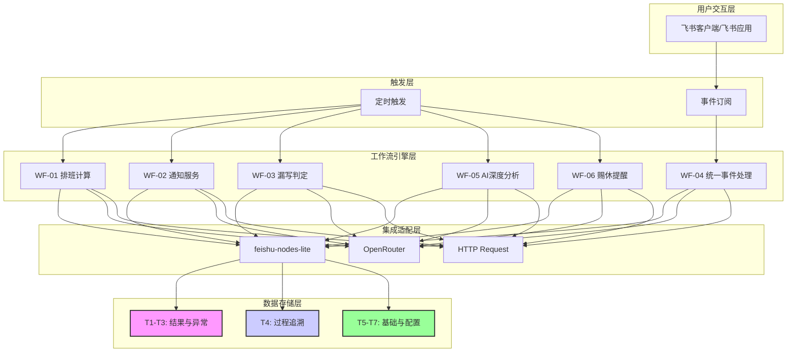
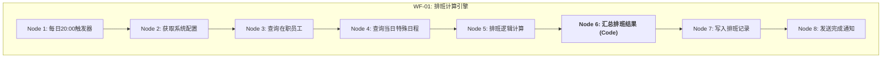
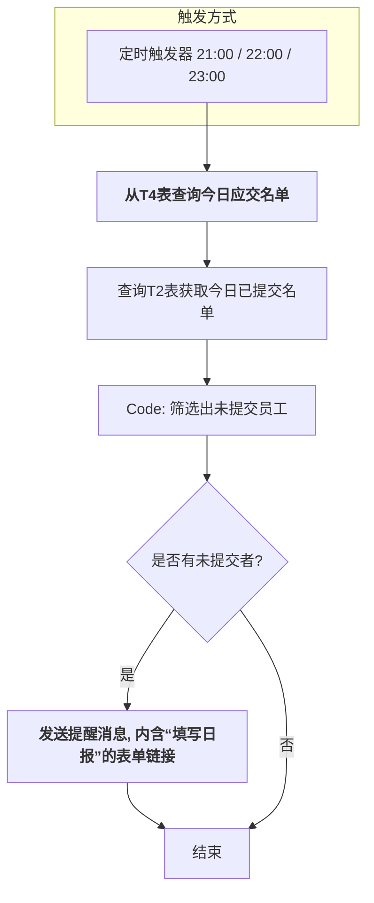
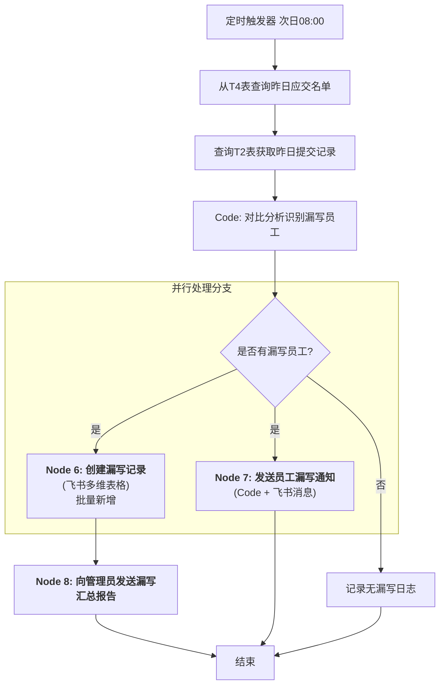
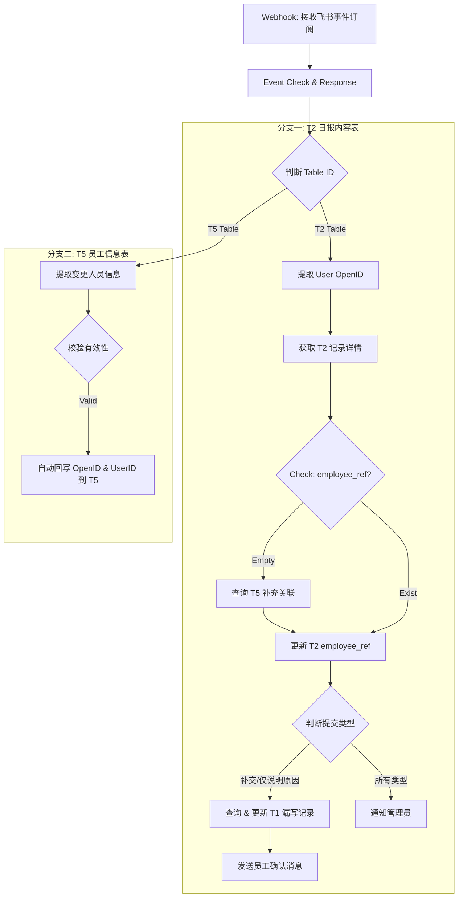
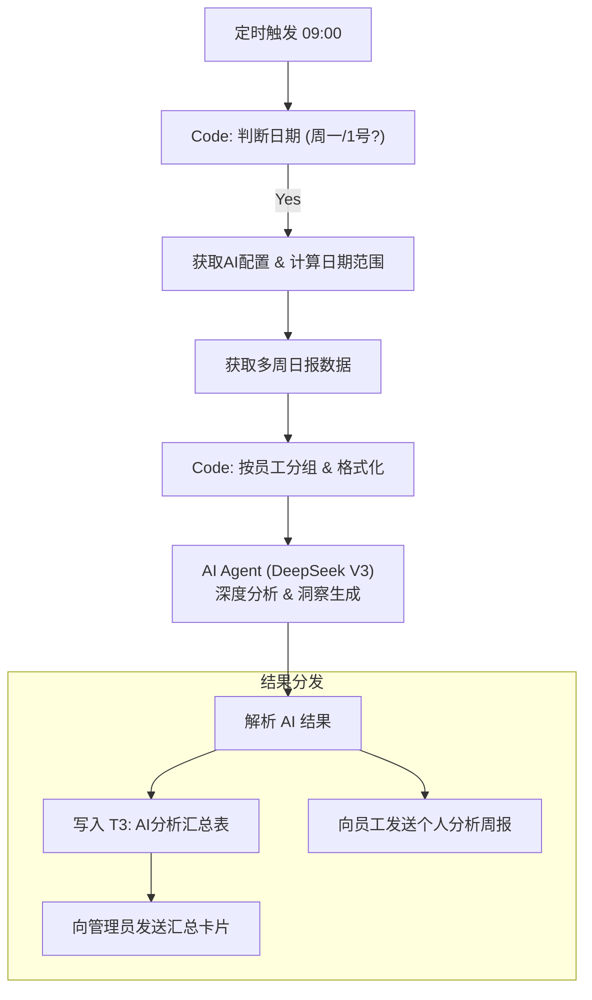

# **智能双日报管理系统 - 完整架构设计 v1.2.0**

## **📋 设计概述**

**版本**: 1.2.0
**发布日期**: 2025-11-28
**设计原则**: **快速落地、核心驱动、统一技术栈、易于维护、AI 深度赋能**
**技术栈**: n8n + feishu-nodes-lite + **Lark Bitable (作为统一数据基座)** + **DeepSeek V3 (via OpenRouter)**

### **设计目标**

设计一套以快速交付和稳定运行为首要目标的 n8n 自动化工作流系统架构。本架构将聚焦于 MVP 的核心价值闭环，通过简化技术栈和统一数据源，确保系统在早期阶段的健壮性、可维护性和可观测性。在 v1.2.0 版本中，重点增强了**事件驱动的实时响应能力**（WF-04）以及**基于 DeepSeek 大模型的深度分析能力**（WF-05）。

---

## **🏗️ 系统架构设计**

### **整体系统架构**

---

## **🔧 工作流模块设计**

### **[WF-01] 排班计算引擎模块**

*   **触发器**: 定时触发器，每日 **20:00** 执行。
*   **核心逻辑**: 计算当日应交日报的员工，并将结果写入 `T4:每日排班记录表`。
*   **排班规则**: 内置智能判断逻辑（代码级），识别单/双休及工作日，并结合 `T6:特殊日程表` 进行豁免处理。
*   **逻辑优化**: 增加了对特殊日程审批状态的校验，只有“已批准”的日程才会触发生效。

### **[WF-02] 提醒与通知服务模块**

*   **触发器**: 定时（每日 **21:00** / **22:00 / 23:00**）。
*   **核心逻辑**: 在日报提交截止前，向当天应交但尚未提交日报的员工，发送一条**友好的提醒消息**，内含一个**指向主日报填写表单的链接**。
*   **去重机制**: 代码级智能防重，确保同一批次内不重复打扰同一员工。

### **[WF-03] 漏写判定与记录服务模块**

*   **触发器**: 定时触发器，每日 **08:00** 执行。
*   **核心逻辑**: 对比**前一日**应交与实交记录，在 `T1:漏写记录表` 中为真正漏写的员工创建状态为“**漏写**”的记录，并发送补交通知。

### **[WF-04] 统一提交处理模块 (Event-Driven)**

*   **触发器**: Webhook 触发器，订阅飞书多维表格的**记录变更事件 (bitable.record.changed)**。
*   **核心逻辑**: 真正的事件总线。根据变更的**数据表 (Table ID)** 分发不同的业务逻辑。
    *   **T2 日报表逻辑**: 自动关联员工信息、处理补交/说明原因状态回写、通知管理员。
    *   **T5 员工表逻辑**: 监听人员字段变更，自动回写 `Open ID` 和 `User ID`，实现员工档案的自动化维护，无需人工干预。

### **[WF-05] AI分析服务模块 (DeepSeek)**

*   **触发器**: 定时触发器（每日 09:00），代码级控制仅在**周一**（周总结）或**每月1日**（月总结）执行。
*   **核心逻辑**: 收集周期内日报数据，调用 **DeepSeek V3** 模型进行深度分析，生成 Summary 和 Insights，结果写入 `T3:AI分析汇总表`，并分别推送给员工本人和管理员。

### **[WF-06] 周五赐休提醒服务**

*   **触发器**: 定时触发器，每周五 **19:00**。
*   **核心逻辑**: 向指定管理员发送“赐休”提醒卡片，提示进行周末事务审批。

---

## **🗄️ 数据架构设计**

### **飞书多维表格完整字段设计**

### **第一优先级：结果与异常数据 (T1-T3)**

#### **T1: 漏写记录表**(tblheX6wjpHT4AhU)
| 字段名                        | 字段类型         | 字段属性   | 说明                                               |
| ----------------------------- | ---------------- | ---------- | -------------------------------------------------- |
| **missed_log_id**             | 自动编号         | 主键       | 漏写记录的唯一ID                                   |
| **employee_ref**              | **多维表格关联** | 必填       | **系统关联**: 链接到`T5`表的`employee_id`主键      |
| **employee_person**           | **人员**         | 必填       | **界面显示**: 用于直观展示员工姓名和头像           |
| **missed_date**               | 日期             | 必填       | 漏写的具体日期                                     |
| status                        | 单选             | 必填       | 记录状态 (**漏写, 已说明原因, 已补交, 已豁免**)    |
| **resolving_submission_ref**  | **多维表格关联** | **可选**   | **系统关联**: 链接到`T2`表中解决此漏写事件的记录   |
| **makeup_explanation_lookup** | **查找引用**     | **(自动)** | **界面显示**: 自动从关联的`T2`记录中查找并显示原因 |
| **makeup_time**               | **日期时间**     | 可选       | 员工完成补交或说明原因的具体时间                   |
| exempt_reason                 | 文本             | 可选       | 管理员填写的豁免原因                               |
| exempt_by                     | 人员             | 可选       | 豁免审批人                                         |
| created_time                  | 创建时间         | 自动填充   | -                                                  |

#### **T2: 日报内容表**(tbl7cWvWrTdfa94C)
| 字段名                 | 字段类型         | 字段属性 | 说明                                               |
| ---------------------- | ---------------- | -------- | -------------------------------------------------- |
| **daily_report_id**    | 自动编号         | 主键     | 日报的唯一ID                                       |
| **employee_ref**       | **多维表格关联** | 必填     | **系统关联**: 链接到`T5`表的`employee_id`主键      |
| **employee_person**    | **人员**         | 必填     | **界面显示**: 用于直观展示员工姓名和头像           |
| **report_date**        | 日期             | 必填     | 日报对应的日期                                     |
| work_content           | 文本             | 可选     | 正常和补交时必填                                   |
| next_plan              | 文本             | 可选     | 正常和补交时必填                                   |
| **makeup_explanation** | **文本**         | **可选** | **补交或仅说明原因时填写。这是原因的唯一数据源。** |
| workload_feeling       | 单选             | 可选     | -                                                  |
| need_assistance        | 复选框           | -        | -                                                  |
| assistance_detail      | 文本             | 条件可选 | -                                                  |
| submission_type        | 单选             | 必填     | 提交类型 (**正常, 补交, 仅说明原因**)              |
| submit_time            | 日期时间         | 自动填充 | -                                                  |

#### **T3: AI分析汇总表**(tbloKNLofcsSWeIs)
| 字段名                | 字段类型 | 字段属性 | 说明                                                     |
| --------------------- | -------- | -------- | -------------------------------------------------------- |
| **analysis_id**       | 自动编号 | 主键     | 分析报告的唯一ID                                         |
| analysis_type         | 单选     | 必填     | 分析类型 (个人, 团队)                                    |
| target_id             | 文本     | 必填     | 目标ID (员工ID或部门ID)，用于n8n处理                     |
| **target_person**     | **人员** | 条件可选 | **界面显示**: 当类型为“个人”时，关联`T5`表员工，方便查看 |
| **period_start_date** | 日期     | 必填     | 分析周期开始日期                                         |
| **period_end_date**   | 日期     | 必填     | 分析周期结束日期                                         |
| summary               | 文本     | 必填     | 分析摘要                                                 |
| insights              | 文本     | 必填     | 关键洞察                                                 |
| recommendations       | 文本     | 必填     | 改进建议                                                 |
| report_url            | 超链接   | 可选     | 详细报告文档链接                                         |
| created_time          | 创建时间 | 自动填充 | -                                                        |

### **第二优先级：过程追溯与日志 (T4)**

#### **T4: 每日排班记录表**(tblvHqDRlBlqH6pf)
| 字段名              | 字段类型         | 字段属性   | 说明                                           |
| ------------------- | ---------------- | ---------- | ---------------------------------------------- |
| **schedule_log_id** | 自动编号         | 主键       | 排班记录的唯一ID                               |
| **schedule_date**   | 日期             | 必填, 索引 | 排班对应的日期                                 |
| **employee_ref**    | **多维表格关联** | 必填, 索引 | **系统关联**: 链接到`T5`表的`employee_id`主键  |
| **employee_person** | **人员**         | 必填       | **界面显示**: 用于直观展示员工姓名和头像       |
| status              | 单选             | 必填, 索引 | 当日状态。选项: `应交`, `休息`, `请假`, `特殊` |
| created_time        | 创建时间         | 自动填充   | -                                              |

### **第三优先级：基础信息与系统配置 (T5-T7)**

#### **T5: 员工信息表**(tblyNoBbIFgOBeAf)
| 字段名              | 字段类型     | 字段属性   | 说明与实践                                                |
| ------------------- | ------------ | ---------- | --------------------------------------------------------- |
| **employee_id**     | **文本**     | **主键**   | **系统业务主键** (如工号)，稳定、不变。将此列放在第一列。 |
| **employee_person** | **人员**     | 必填       | **员工核心字段**。包含姓名、头像，n8n写入用户Open ID。    |
| open_id             | 文本         | 索引, 唯一 | 飞书Open ID，用于API交互。                                |
| department          | **查找引用** | (自动)     | 自动从`employee_person`字段引用，与飞书通讯录同步。       |
| manager_person      | **查找引用** | (自动)     | 自动从`employee_person`字段引用，与飞书通讯录同步。       |
| email               | **查找引用** | (自动)     | 自动从`employee_person`字段引用，与飞书通讯录同步。       |
| shift_template      | 单选         | 必填       | 排班模板。                                                |
| status              | 单选         | 必填       | 在职状态 (在职, 离职)。                                   |
| **submitted_count** | 数字         | (未来增强) | 累计提交日报次数。                                        |
| **missed_count**    | 数字         | (未来增强) | 累计漏写日报次数。                                        |
| created_time        | 创建时间     | 自动填充   | -                                                         |

#### **T6: 特殊日程表**(tbl22m05icg1ipS0)
| 字段名                   | 字段类型         | 字段属性 | 说明                                          |
| ------------------------ | ---------------- | -------- | --------------------------------------------- |
| **special_schedule_id**  | 自动编号         | 主键     | 特殊日程の唯一ID                              |
| **employee_ref**         | **多维表格关联** | 必填     | **系统关联**: 链接到`T5`表的`employee_id`主键 |
| **employee_person**      | **人员**         | 必填     | **界面显示**: 用于直观展示员工姓名和头像      |
| **schedule_change_date** | 日期             | 必填     | 日程变更的具体日期                            |
| schedule_type            | 单选             | 必填     | 日程类型 (请假, 出差, 调休, 特殊排班, 节假日) |
| reason                   | 文本             | 可选     | 原因说明                                      |
| approver_person          | 人员             | 可选     | 审批人                                        |
| approval_status          | 单选             | 必填     | 状态 (待审批, 已批准, 已驳回)                 |
| created_time             | 创建时间         | 自动填充 | -                                             |

#### **T7: 系统配置参数表**(tblrwN6JvCyWfVna)
| 字段名          | 字段类型 | 字段属性   | 说明                                             |
| --------------- | -------- | ---------- | ------------------------------------------------ |
| **config_id**   | 自动编号 | 主键       | 配置项的唯一ID                                   |
| parameter_name  | 文本     | 必填, 唯一 | 参数名称，供n8n调用                              |
| parameter_value | 文本     | 必填       | 参数值。例如: `ADMIN_OPEN_IDS`, `REMINDER_TIMES` |
| description     | 文本     | 必填       | 参数描述，说明用途和格式                         |
| category        | 单选     | 必填       | 配置分类 (排班, 通知, AI, 系统)                  |
| modified_time   | 修改时间 | 自动填充   | -                                                |

---

## **🚀 后续演进与规划**

本部分用于记录在 `v1.0.0` 之后可以引入的增强功能，以确保优秀的想法不会被遗忘。

### **1. 员工日报统计功能**

*   **目标**: 长期追踪并量化每位员工的日报提交和漏写情况，为绩效评估或管理谈话提供数据支持。
*   **数据模型变更**:
    *   在 `T5:员工信息表` 中，已预留 `submitted_count` 和 `missed_count` 两个数字类型字段。
*   **工作流逻辑变更**:
    *   **WF-04 (统一提交处理)**: 在每次成功写入 `T2:日报内容表` 且`submission_type`为“正常”或“补交”时，增加一个步骤，将其`submitted_count`字段的值加 1。
    *   **WF-03 (漏写判定)**: 在每次成功写入 `T1:漏写记录表` 后，增加一个步骤，将其`missed_count`字段的值加 1。

---

## **🔧 技术与部署**

### **技术选型与错误处理**
*   **工作流引擎**: n8n (自托管 Docker 版本)。
*   **核心集成**: `n8n-nodes-feishu-lite`, `OpenRouter (DeepSeek V3)`.
*   **数据库**: 飞书多维表格 (Lark Bitable)。
*   **错误处理**: 采用**节点级重试**（`Retry On Fail`）和**工作流级告警**（`Error Workflow`）相结合的策略。
*   **[核心最佳实践]** **执行一次（Execute Once）**: 对于接收多项输入但自身逻辑只应执行一次的节点（如批量创建、汇总报告），**必须**在其 Settings 中开启 Execute Once 选项，以防止因上游输出多项item而导致节点被重复执行。

### **权限与部署**
*   **权限控制**: **完全依赖飞书多维表格的原生权限管理能力**。
*   **部署架构**: 采用**Docker**在云服务器部署n8n单实例容器，区分**开发**与**生产**两套环境及对应的数据表。

---

## **📝 版本修订历史**

*   **v1.2.0 (2025-11-28) - “智识版 (Cognition Edition)”**
    - **[WF-04 架构重构]** 升级为双通道事件处理架构。新增对 `T5:员工信息表` 的监听，实现了员工 OpenID/UserID 的自动化回写维护，大幅降低运维成本。
    - **[WF-05 AI 升级]** 模型升级为 **DeepSeek V3** (via OpenRouter)，提供更精准的代码级工作审计和洞察。新增了“员工个人周报推送”功能，形成反馈闭环。
    - **[WF-06 新增服务]** 增加“周五赐休提醒”工作流。
    - **[WF-01 逻辑优化]** 明确了排班计算中的工作日/节假日逻辑及审批状态校验。
*   **v1.1.0 (2025-11-10) - “守望者版”**
    - **[WF-04 架构升级]** 将 WF-04 的触发机制从简单的表单提交 Webhook，升级为响应飞书事件订阅的模式。
    - **[WF-04 新增逻辑]** 在工作流入口处增加了“门卫”节点 (IF)，用于精确过滤仅由 T2:日报内容表 触发的事件，提高了工作流的健壮性和效率。
*   **v1.0.0 (2025-11-09)**
    - 项目首个稳定版本 **“黎明版 (Daybreak Edition)”** 发布。
    - 完成了 WF-01, WF-02, WF-03, WF-04 的设计、实施，并与文档体系完全对齐。
    - 建立了统一的版本管理规范。
